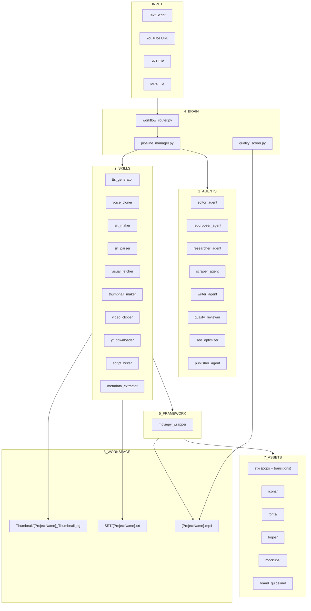

# SEOSONA Video Factory — System Architecture

## Overview

SEOSONA Video Factory is a multi-brand automated video production system connected to SEOSONA OS (`~/.seosona`). It supports 2 brands: **SEOSONA** (Business) and **Chí Quyết Academy** (Creator).

## Architecture Diagram



## Workflow Pipelines

### Mode 1: Create (New Video)
```
Text → TTS/Voice Clone → Whisper (SRT) → Visual Fetcher → MoviePy Render → Quality Check → Output
```

### Mode 2: Repurpose (Long → Short)
```
MP4/SRT → SRT Parser → SRT Analyzer Agent → Video Clipper → MoviePy Render → Thumbnail → Output
```

### Mode 3: Download (YouTube → Short)
```
URL → yt-dlp → Audio Extract → Whisper → SRT Analyzer → Clipper → Output
```

## Directory Structure

```
D:\SEOSONA Video\
├── 1_AGENTS/          → AI Agents (Analysis, Review, SEO, Publishing)
├── 2_SKILLS/          → Technical Skills (TTS, Whisper, Clipper, yt-dlp)
├── 3_MEMORY/          → Project Memory (Logs, Errors, Knowledge, Brand)
├── 4_BRAIN/           → Orchestration (Router, Pipeline, Scorer)
├── 5_FRAMEWORK/       → Render Engine (MoviePy, Effects, Typography, Audio)
├── 6_SOP/             → Standard Operating Procedures
├── 7_ASSETS/          → Asset Library (SFX, Icons, Fonts, Logos, Mockups)
├── 8_WORKSPACE/       → Production Output
├── system_config.yaml → Multi-brand Configuration
├── requirements.txt   → Python Dependencies
└── ARCHITECTURE.md    → This file
```

## Iron Rules

1. **Tech-Editorial Minimalism** — Maximum white space, professional layout. Minimal text, massive size, Be Vietnam Pro font. NO 3D/colorful icons.
2. **Multi-Brand** — SEOSONA (Dark Navy #1A2DB5 / Tech Minimalism) vs CQA (Royal Blue/Pop).
3. **File Name = Project Name** — All outputs must carry the project/video name.
4. **Standard SRT Format** — No JSON for subtitles. SubRip (.srt) only.
5. **Randomized Effects** — SFX and transitions must vary, never repeat the same one.
