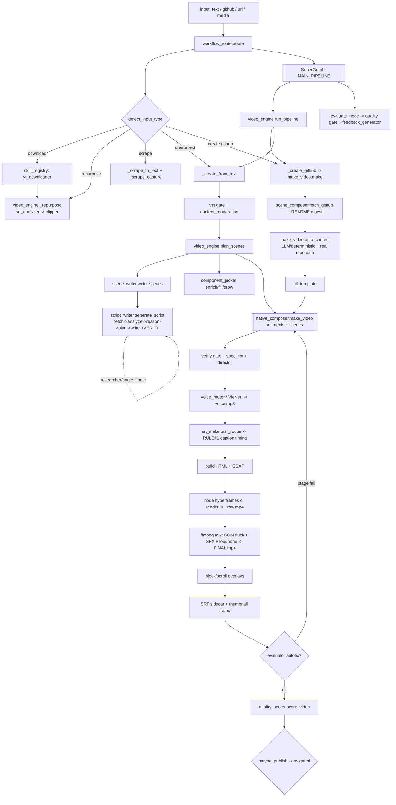

# 03 — WORKFLOW & NODE MAP

> The ACTUAL current pipeline from input → output MP4. Node states verified against code.
> Legend: **CONFIRMED** (code evidence) · **INFERRED** · **UNKNOWN**.
> There is **no visual node-graph editor** — the "workflow" is a Python `SuperGraph` state machine (`4_BRAIN/graph_executor.py`) wrapping the engine. The only UI is the read-only Flask dashboard (port 5050).

## Pipeline flowchart (verified)

## Node table (critical-path nodes marked ⭐)

| Node | Purpose | Input | Output | Provider/Script | Run condition | Status | Main code file |
|---|---|---|---|---|---|---|---|
| ⭐ Router | Detect input, wrap engine in SuperGraph | raw input str | graph state | `route()` | always | CONFIRMED wired | `4_BRAIN/workflow_router.py:55` |
| ⭐ Input detect | Classify text/github/url/media | str | `(mode, input)` | `detect_input_type` | always | CONFIRMED | `4_BRAIN/video_engine.py:56` |
| Research | Topic → real facts | topic str | `{raw_text, sources[]}` | `researcher.research` (News RSS/Firecrawl/DDG) | topic path only | CONFIRMED (keyless, best-effort) | `4_BRAIN/researcher.py` |
| ⭐ Script write A | 6-stage verified narration | topic/facts | `Script` (scenes) + VerifyResult | `script_writer.generate_script` | text/topic path | CONFIRMED (LLM cascade, traceability gate) | `4_BRAIN/script_writer.py:556` |
| ⭐ Script write B | GitHub repo → prose w/ real data | repo data | `content{segments,scenes}` | `make_video.auto_content` | github path | CONFIRMED | `4_BRAIN/make_video.py:498` |
| ⭐ Scene plan | text → segments + scene dicts | script text | `(segments[], scenes[])` | `video_engine.plan_scenes` | text path | CONFIRMED | `4_BRAIN/video_engine.py:360` |
| ⭐ Component pick | scene text → native component | scene text | `(kind, data)` | `component_picker` | per middle scene | CONFIRMED | `4_BRAIN/component_picker.py` |
| ⭐ Template fill | merge structure + content | template+content | `(segments, scenes)` | `native_composer.fill_template` | template/github | CONFIRMED (hard len check) | `native_composer.py:3242` |
| Director | annotate motion/SFX/icon/fx | scenes | mutated scenes | `director.direct` | in make_video | CONFIRMED (icon/chips consumption unverified) | `4_BRAIN/director.py` |
| Spec lint | blank-risk / pacing / truncation | edit spec | warnings/raise | `spec_lint` | pre-render | CONFIRMED | `4_BRAIN/spec_lint.py` |
| Moderation | real-data / brand-safe gate | script | pass/block/flag | `content_moderation` | pre-render | CONFIRMED (1020 events logged) | `4_BRAIN/content_moderation.py` |
| ⭐ Voice/TTS | narration → mp3 | text | `assets/voice.mp3` | `voice_router` → VieNeu (OmniVoice primary if GPU) | always | CONFIRMED | `2_SKILLS/voice_cloner/voice_router.py` |
| ⭐ Caption timing | ASR word-align to display | voice.mp3 | word timings, `_cc.srt` | `asr_router` → PhoWhisper + RULE#1 | always | CONFIRMED | `2_SKILLS/srt_maker/asr_router.py` |
| ⭐ HTML build | scenes → GSAP HTML doc | scenes | `index.html` | native_composer (GSAP 3.14) | always | CONFIRMED | `native_composer.py:2924` |
| ⭐ Render | HTML → raw mp4 | index.html | `_raw.mp4` | `node hyperframes/dist/cli.js render` | always | CONFIRMED (needs abs path) | `native_composer.py:2946` |
| ⭐ Audio mix | BGM duck + SFX + loudnorm | _raw.mp4 + voice | `FINAL.mp4` | ffmpeg filter_complex | always | CONFIRMED | `native_composer.py:2992` |
| BGM source | CC music by mood | mood | audio + credit | `bgm_sourcer` (Openverse/Jamendo) | keyless | CONFIRMED | `2_SKILLS/bgm_sourcer` |
| Overlays | block/scroll cutaways | FINAL.mp4 | composited mp4 | `_overlay_blocks/_scroll` | if blocks present | CONFIRMED | `native_composer.py:3049` |
| Thumbnail | designer PNG + frame grab | content / mp4 | `Thumbnail/*.png` | `thumbnail_maker` + `frame_scorer` | always | CONFIRMED | `video_engine.py:602` |
| ⭐ QA score | 0–100 quality gate | FINAL.mp4 | score + verdict | `quality_scorer.score_video` | always | CONFIRMED (gate lenient — see below) | `4_BRAIN/quality_scorer.py:24` |
| Evaluator | silent/black/short maker-checker | FINAL.mp4 | ok/fix | `evaluator.evaluate` | autofix + publish gate | CONFIRMED | `4_BRAIN/evaluator.py` |
| Publish | upload YT/TikTok/FB/GDrive/TG | package | receipt | `publisher_agent.publish_dispatch` | env-gated (OFF) | CONFIRMED but never real (dry-run only) | `1_AGENTS/publisher_agent/` |
| Analytics ingest | pull view metrics | video id | metrics | `performance_ingest.ingest` | post-publish | **STUB — live YT pull `return None`** | `1_AGENTS/.../performance_ingest.py:47` |

## Nodes with UI but no logic
**None** — there is no node UI. The Flask dashboard has a "Studio" endpoint (`/api/studio/generate`, `/api/studio/jobs`) that enqueues, but it drives the same Python engine; no orphan-UI node was found.

## Nodes with logic but NOT wired into the automated workflow (orphaned)
- `4_BRAIN/seedance_engine.py` + `seedance_director.py` — Engine #6 (generative b-roll). CLI-only; reached only via `scripts/ltx_video.py`. **Not called by router/engine.** (CONFIRMED)
- `4_BRAIN/lipsync_service.py`, `dub_align.py` — avatar/dub engines. No automated caller. (CONFIRMED)
- `scripts/portrait_avatar.py` (SadTalker #3), `liveportrait_motion.py` (#5), `lipsync_musetalk.py` (#3b) — standalone; **venvs currently missing** so cannot run. (CONFIRMED)
- `4_BRAIN/knowledge_graph.py` — read-only second brain; dashboard/CLI only, not render. (CONFIRMED)
- `4_BRAIN/discovery.py` — topic-discovery front-end; only `daily_production.py`. (CONFIRMED)
- Talking-head engine (`scripts/talking_head_*`) — wired ONLY via the course path (`course_video.py`), not the main news/create path. (CONFIRMED)
- `4_BRAIN/factory_brain.py` / `learn_flywheel.py` / `factory_ledger.py` — autonomous-batch layer above the render; not part of a single `route()` call. (CONFIRMED)

## Data-loss / schema-mismatch points (CONFIRMED)
1. **Double script-write on the topic path** — `topic_to_video.py:121` produces a *verified* `Script` (headings, comp hints, fx), then passes only joined narration to `route()`; `plan_scenes` re-runs the LLM writer, **discarding the structured fields** and paying a second LLM cost. `topic_to_video.py:164` + `video_engine.py:369`.
2. **QA ffprobe from bare PATH** — `quality_scorer.py:58` calls `"ffprobe"` directly (not the bundled `-static` binary). If ffprobe isn't on Windows PATH → `FileNotFoundError` → **15 pts partial-credited** → **score inflation**; stream/aspect/duration validation silently skipped. See [FAILURE_ANALYSIS](06_FAILURE_ANALYSIS.md) HIGH-1.
3. **Anti-compression drops component hints** — `video_engine.py:374` nulls `plan`/`_whints` when the LLM over-compressed, losing per-scene `comp_hint/block/fx` for that video.
4. **`fill_template` hard length coupling** — count mismatch → `ValueError` render abort rather than graceful degrade. `native_composer.py:3246`.
5. **Inconsistent import paths** — `4_BRAIN.quality_scorer` vs `quality_scorer` (latent `sys.path` fragility). `workflow_router.py:157` vs `video_engine.py:628`.

## Critical path (minimum to produce a complete video)
`route → detect → (script write A/B) → plan_scenes/fill_template → native_composer.make_video{ voice → caption-timing → HTML → hyperframes render → ffmpeg mix } → thumbnail → quality_scorer`. Every path funnels through the single chokepoint **`native_composer.make_video`** (`native_composer.py:2177`). No stubs or mocks exist in this hot path.
