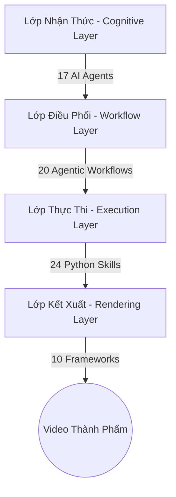

# Tổng quan Hệ sinh thái SEOSONA Video

<div align="center">
  
</div>

Chào mừng bạn đến với tài liệu cốt lõi của **SEOSONA Video Autonomous Factory**. Đây là một Nhà máy Sản xuất Truyền thông Đa phương tiện hoàn toàn tự động, được thiết kế và làm chủ 100% bởi **SEOSONA AI**. 

## 1. Mục đích Hệ thống
Hệ thống này được sinh ra để loại bỏ hoàn toàn sự can thiệp của con người trong quá trình sản xuất nội dung video. Bằng cách kết hợp Trí tuệ nhân tạo (Agents), Xử lý ngôn ngữ tự nhiên (LLMs), Engine Kết xuất giao diện (Puppeteer/HyperFrames), và các thuật toán thị giác máy tính, SEOSONA Video có khả năng biến 1 dòng ý tưởng thành 1 video viral trên Tiktok, Youtube, Instagram Reels chỉ trong vòng chưa đầy 3 phút.

## 2. Sơ đồ Kiến trúc Phân tầng



> [!NOTE]
> Hệ thống được thiết kế theo cấu trúc "Tách rời Nguồn lực". Những Agent giỏi tư duy sẽ không đụng vào mã render, và những đoạn code đồ họa thì hoàn toàn im lặng chờ Agent gọi đến.

## 3. Không gian làm việc (Workspaces)

Toàn bộ quá trình đúc video diễn ra tại thư mục `8_WORKSPACE/`. Đây là "công xưởng" tạm thời để lắp ráp các mảnh ghép trước khi xuất xưởng.

<details>
<summary><b>📂 Mở rộng để xem cấu trúc Workspaces</b></summary>

```text
8_WORKSPACE/
├── supergraph-news/            : Dự án Video Tin tức tạo bằng công cụ tự động sạch sẽ nhất
├── _drafts/                    : Các ý tưởng và bản nháp kịch bản tạm thời
├── _scripts/                   : Các đoạn script chạy một lần
└── _ARCHIVE/                   : Kho lưu trữ lịch sử và hơn 60 bài test biên dịch cũ
```
</details>

## 4. SEOSONA Project Bridge
Là cầu nối dòng lệnh CLI (`scripts/seosona-project-bridge.cjs`) giúp kết nối Nhà máy sản xuất tự động này với nhân hệ điều hành trung tâm của SEOSONA OS.
