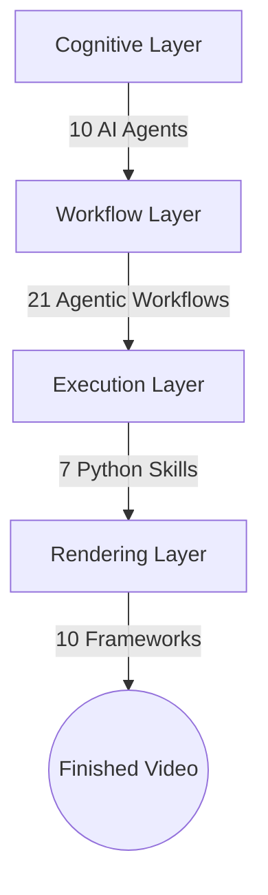

# SEOSONA Video Ecosystem Overview

<div align="center">
  
</div>

Welcome to the core documentation of the **SEOSONA Video Autonomous Factory**. This is a fully automated multimedia production factory, designed and mastered 100% by **SEOSONA AI**.

## 1. System Purpose
This system was created to completely eliminate human intervention in the video content production process. By combining Artificial Intelligence (Agents), Natural Language Processing (LLMs), a native Rendering Engine (`video_engine` → `native_composer` + HyperFrames), and computer vision algorithms, SEOSONA Video is able to turn a single line of an idea into a viral video on TikTok, YouTube, and Instagram Reels in under 3 minutes.

## 2. Layered Architecture Diagram



> [!NOTE]
> The system is designed around a "Resource Decoupling" structure. Agents that excel at reasoning never touch the render code, and the graphics code stays completely silent until an Agent calls it.

## 3. Workspaces

The entire video casting process takes place in the `8_WORKSPACE/` directory. This is the temporary "workshop" for assembling the pieces before shipping.

<details>
<summary><b>📂 Expand to see the Workspaces structure</b></summary>

```text
8_WORKSPACE/
├── supergraph-news/            : News Video project created with the cleanest automated tooling
├── _drafts/                    : Temporary ideas and draft scripts
├── _scripts/                   : One-off run scripts
└── _ARCHIVE/                   : Historical archive and over 60 old compilation tests
```
</details>

## 4. SEOSONA Project Bridge
This is the CLI command bridge (`scripts/seosona-project-bridge.cjs`) that connects this Autonomous Production Factory with the central kernel of SEOSONA OS.
