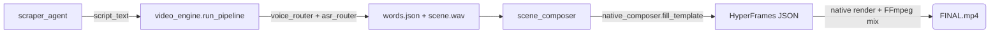

# Anatomy of All 7 Operating Pipelines (Step-by-step)

Below is the exact reveal of how each grain of data moves through the system to form the various video masterpieces.

<b>🎥 PIPELINE 1: Native News Pipeline (9:16 News Video)</b>

 

An extremely powerful pipeline that turns a single Text news item into a vibrant TikTok video in just 60 seconds.

1. **Ingestion:** `scraper_agent` pushes the raw data. `seo_writer_agent` reshapes it into a script (`script_text`) fed into `video_engine.run_pipeline`.
2. **Generate Voice:** `native_composer` calls `voice_router.synthesize_voice` (**OmniVoice — the ONLY engine**; a failed synth returns None, no fallback). It outputs `voice.mp3` (paced + loudnorm).
3. **Beat Matching:** The `.wav` file is passed through `asr_router` (PhoWhisper-large-ct2 on `faster-whisper`, cuda auto-detect). It returns `words.json` containing the millisecond coordinates of EVERY WORD, used for the RULE #1 subtitles.
4. **Initialize Graphics:** `scene_composer` picks a JSON template in `7_ASSETS/templates/`, and `native_composer.fill_template` pours the content into a 1080x1920 HyperFrames frame matched to `words.json`.
5. **Render:** `native_composer` renders the HyperFrames natively (no need to screenshot each frame).
6. **Mix & Merge:** `ffmpeg` combines the original audio, mixes the ducked BGM, and inserts SFX/"Woosh" transitions right inside `native_composer`.
7. **Ship:** `FINAL.mp4` is passed through `4_BRAIN/quality_scorer.py` to measure quality/LUFS, then `publisher_agent` uploads it.
 

<b>👤 PIPELINE 2: Faceless Explainer Pipeline (Faceless Video 16:9)</b>

 

For academic topics and in-depth technology, 3-5 minutes long.

1. **Write script:** `seo_writer_agent` receives the topic and writes it into a 5-part script (`script_text`).
2. **Music:** `voice_router` generates the voiceover (OmniVoice). `native_composer` mixes the ducked background music (BGM).
3. **Generate Graphics:** Activates `motion-graphics` to generate animated Typography, charts (Data-Viz), and particle loops from `news_loop_path_hyperframes`.
4. **Assemble:** `scene_composer` + `native_composer` join these blocks together using `hf_core`. Renders the MP4 natively.
 

<b>🚀 PIPELINE 3: Product Launch Pipeline (Product Advertising Video)</b>

 

Creates flashy Feature Reveal videos for a SaaS software product.

1. **Get Data:** `scraper_agent` scrapes the logo, brand colors, and fonts from the URL link.
2. **Screenshots:** `video_engine` uses Playwright to visit the product homepage and capture full-size screenshots.
3. **Mockup Assembly:** Feeds them into `hf_cards` to place the screenshots inside a 3D Neon Laptop/Phone.
4. **Effects:** `native_composer` injects pop sounds and fast-paced mouse clicks from the SFX library. Exports an Apple-standard video.
 

<b>💻 PIPELINE 4: PR-to-Video (Feature Illustration from Code Diff)</b>

 

Turns a dry block of code (Diff Text) into a visual explainer video. *(Note: This is merely reading Text from a Pull Request URL, absolutely NOT "Repo Analysis".)*

1. **Scan PR URL:** `scraper_agent` parses the Text from a specific Github Pull Request (Title, Body, Code Diff +/-).
2. **Translate:** `seo_writer_agent` (via `llm_engine`) explains that line of code in human language.
3. **Simulate Code:** `hf_cards` creates a "Terminal" card. The code is automatically syntax-highlighted and runs a typewriter keystroke effect.
4. **Analyze:** Switches to a Chart Component card describing how the new feature speeds up the system. Renders the MP4.
 

<b>🌐 PIPELINE 5: Website-to-Video (Turning a Website into a Tour Video)</b>

 

1. **Enter URL:** The user provides a Landing Page link.
2. **Auto Scroll:** `video_engine` uses Playwright to act as a user, automatically scrolling the page smoothly and hovering over buttons to record the behavior (Screencast).
3. **Label:** `graphic-overlays` pastes floating Text cards that track the buttons on the web interface. Exports a Tour Video.
 

<b>🎬 PIPELINE 6: Edit Footage & Graphic Overlays</b>

 

Packages graphics onto pre-recorded video (Talking head).

1. **Receive raw video:** User pushes an MP4 file (recorded on a phone) into `8_WORKSPACE`.
2. **Transcribe:** `asr_router` (PhoWhisper-large-ct2 on `faster-whisper`) produces the Transcript.
3. **Activate cards:** Based on the Transcript, `srt_analyzer` sets timestamps. (e.g.: when the word "Tuyệt vời" is spoken, the system throws a 3D "Tuyệt Vời" text card flying across).
4. **Merging:** `native_composer` uses FFmpeg to paste the transparent (Alpha-channel) layer of the graphic card on top of the original video.
 

<b>♻️ PIPELINE 7: Repurposing (Content Recycling)</b>

 

Turns 1 long video into 10 short videos.

1. **Split:** `repurposer_agent` (via `srt_analyzer`) consumes a 1-hour-long video. It scans for segments with high volume frequency and lots of laughter.
2. **Smart Crop:** `clipper` detects faces, pushes the 16:9 frame onto the speaker's face, and crops vertically into 9:16.
3. **Burn Subtitles:** Calls the `embedded-captions` flow to embed huge subtitles in the center of the chest.
4. **Harvest:** Produces 5-10 Shorts videos from the original video.
 

