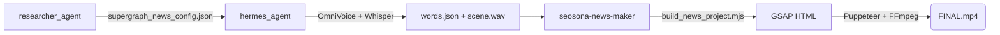

# Giải phẫu Toàn bộ 7 Quy trình Vận hành (Step-by-step)

Dưới đây là tiết lộ chính xác cách thức từng hạt dữ liệu di chuyển trong hệ thống để tạo thành các tuyệt tác video khác nhau.

<b>🎥 QUY TRÌNH 1: Native News Pipeline (Video Tin tức 9:16)</b>

 

Quy trình cực mạnh biến 1 bản tin Text thành 1 video Tiktok rực rỡ chỉ trong 60 giây.

1. **Nạp liệu:** `researcher_agent` đẩy dữ liệu thô. `seo_writer_agent` nhào nặn lại thành `supergraph_news_config.json`.
2. **Tạo Tiếng:** `hermes_agent` đọc file JSON, gọi ổ đĩa ảo `.venv-omnivoice`. OmniVoice nhả ra file `scene_X.wav`.
3. **Khớp Nhịp:** Đưa file `.wav` qua mô hình `faster-whisper`. Whisper trả về `words.json` chứa tọa độ mili-giây của TỪNG CHỮ.
4. **Khởi tạo Đồ họa:** Kích hoạt script `build_news_project.mjs`. Tạo `scene_X.html` 1080x1920, nhúng GSAP khớp với `words.json` tạo Karaoke.
5. **Kết Xuất:** `html_renderer` dùng Chrome ảo, chụp liên thanh (30 hình/giây).
6. **Gộp Trộn:** `ffmpeg` gom ảnh, ghép âm thanh gốc, chèn hiệu ứng chuyển cảnh "Woosh" qua `sfx_mixer`.
7. **Xuất Xưởng:** `FINAL.mp4` được đưa qua `quality_reviewer` đo LUFS, rồi `publisher_agent` tải lên.
 

<b>👤 QUY TRÌNH 2: Faceless Explainer Pipeline (Video Không Mặt 16:9)</b>

 

Dành cho các chủ đề học thuật, công nghệ chuyên sâu dài 3-5 phút.

1. **Viết kịch bản:** `writer_agent` nhận chủ đề, viết thành `narrator_scripts.json`.
2. **Âm nhạc:** `tts_generator` sinh giọng đọc. `hermes_agent` gọi MusicGen sinh nhạc nền (BGM).
3. **Sinh Đồ họa:** Kích hoạt `motion-graphics` sinh ra Typography động, biểu đồ (Data-Viz), vòng lặp hạt từ `news_loop_path_hyperframes`.
4. **Lắp ráp:** Ghép các khối trừu tượng này lại bằng `hf_core`. Render MP4.
 

<b>🚀 QUY TRÌNH 3: Product Launch Pipeline (Video Quảng Cáo Sản Phẩm)</b>

 

Tạo các video phô diễn tính năng (Feature Reveal) hào nhoáng cho một phần mềm SaaS.

1. **Lấy Dữ liệu:** `visual_fetcher` cào logo, mã màu (Brand Colors), font chữ từ link URL.
2. **Chụp Màn Hình:** `html_renderer` (Puppeteer) vào trang chủ sản phẩm, chụp Full-size Screenshots.
3. **Ghép Mockup:** Đưa vào `hf_cards` nhốt ảnh chụp vào Laptop/Điện thoại 3D Neon.
4. **Hiệu ứng:** `sfx_mixer` bơm tiếng pop, click chuột nhịp độ nhanh (Fast-paced). Xuất video chuẩn Apple.
 

<b>💻 QUY TRÌNH 4: PR-to-Video (Chuyển Đổi Mã Code Github Thành Video)</b>

 

Biến một đoạn code khô khan thành một video giải thích trực quan.

1. **Quét PR:** `scraper_agent` bóc tách Github Pull Request (Title, Body, Code Diff +/-).
2. **Dịch thuật:** `llm_processor` giải thích dòng code đó bằng ngôn ngữ con người.
3. **Mô phỏng Code:** `hf_cards` tạo thẻ "Terminal". Mã code được tự động đánh màu Syntax Highlighting và chạy hiệu ứng gõ phím máy chữ.
4. **Phân tích:** Chuyển sang thẻ Đồ thị (Chart Component) mô tả tính năng mới giúp hệ thống chạy nhanh ra sao. Render MP4.
 

<b>🌐 QUY TRÌNH 5: Website-to-Video (Chuyển Website Thành Video Tour)</b>

 

1. **Nhập URL:** Người dùng cung cấp link Landing Page.
2. **Auto Scroll:** `html_renderer` đóng vai người dùng, tự động cuộn trang mượt mà, hover vào các nút bấm để quay lại hành vi (Screencast).
3. **Dán nhãn:** `graphic-overlays` dán các thẻ Text lơ lửng bám theo các nút bấm trên giao diện web. Xuất ra Video Tour.
 

<b>🎬 QUY TRÌNH 6: Edit Footage & Graphic Overlays</b>

 

Đóng gói Graphic lên Video người quay sẵn (Talking head).

1. **Nhận video thô:** User đẩy file MP4 (quay bằng điện thoại) vào `8_WORKSPACE`.
2. **Bóc băng:** `faster-whisper` chạy ra Transcript.
3. **Kích hoạt thẻ:** Dựa vào Transcript, `hermes_agent` đặt mốc thời gian. (vd: Nói chữ "Tuyệt vời", hệ thống quăng bảng 3D chữ "Tuyệt Vời" bay ngang qua).
4. **Nối đè (Merging):** Dùng FFmpeg dán lớp trong suốt (Alpha-channel) của thẻ đồ họa đè lên video gốc.
 

<b>♻️ QUY TRÌNH 7: Repurposing (Tái Chế Nội Dung)</b>

 

Biến 1 video dài thành 10 video ngắn.

1. **Chia nhỏ:** `repurposer_agent` ngậm 1 video dài 1 tiếng. Dò tìm các đoạn có tần số âm lượng lớn, nhiều tiếng cười.
2. **Crop thông minh:** Nhận diện khuôn mặt đẩy khung 16:9 vào mặt người nói, crop dọc thành 9:16.
3. **Dán Phụ đề:** Gọi luồng `embedded-captions` nhúng phụ đề to đùng giữa ngực.
4. **Thu hoạch:** Sinh ra 5-10 video Shorts từ video gốc.
 

