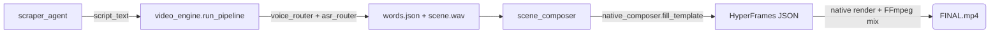

# Giải phẫu Toàn bộ 7 Quy trình Vận hành (Step-by-step)

Dưới đây là tiết lộ chính xác cách thức từng hạt dữ liệu di chuyển trong hệ thống để tạo thành các tuyệt tác video khác nhau.

<b>🎥 QUY TRÌNH 1: Native News Pipeline (Video Tin tức 9:16)</b>

 

Quy trình cực mạnh biến 1 bản tin Text thành 1 video Tiktok rực rỡ chỉ trong 60 giây.

1. **Nạp liệu:** `scraper_agent` đẩy dữ liệu thô. `seo_writer_agent` nhào nặn lại thành kịch bản (`script_text`) đưa vào `video_engine.run_pipeline`.
2. **Tạo Tiếng:** `native_composer` gọi `voice_router.synthesize_voice` (VieNeu clone/preset, fallback edge-tts). Nhả ra file `scene_X.wav`.
3. **Khớp Nhịp:** Đưa file `.wav` qua `asr_router` (`faster-whisper`). Trả về `words.json` chứa tọa độ mili-giây của TỪNG CHỮ, dùng cho phụ đề RULE #1.
4. **Khởi tạo Đồ họa:** `scene_composer` chọn template JSON trong `7_ASSETS/templates/`, `native_composer.fill_template` đổ nội dung vào khung HyperFrames 1080x1920 khớp với `words.json`.
5. **Kết Xuất:** `native_composer` render native các HyperFrames (không cần chụp màn hình từng frame).
6. **Gộp Trộn:** `ffmpeg` ghép âm thanh gốc, trộn BGM đã ducking và chèn SFX/chuyển cảnh "Woosh" ngay trong `native_composer`.
7. **Xuất Xưởng:** `FINAL.mp4` được đưa qua `4_BRAIN/quality_scorer.py` đo chất lượng/LUFS, rồi `publisher_agent` tải lên.
 

<b>👤 QUY TRÌNH 2: Faceless Explainer Pipeline (Video Không Mặt 16:9)</b>

 

Dành cho các chủ đề học thuật, công nghệ chuyên sâu dài 3-5 phút.

1. **Viết kịch bản:** `seo_writer_agent` nhận chủ đề, viết thành kịch bản 5 phần (`script_text`).
2. **Âm nhạc:** `voice_router` sinh giọng đọc (VieNeu). `native_composer` trộn nhạc nền (BGM) đã ducking.
3. **Sinh Đồ họa:** Kích hoạt `motion-graphics` sinh ra Typography động, biểu đồ (Data-Viz), vòng lặp hạt từ `news_loop_path_hyperframes`.
4. **Lắp ráp:** `scene_composer` + `native_composer` ghép các khối này lại bằng `hf_core`. Render MP4 native.
 

<b>🚀 QUY TRÌNH 3: Product Launch Pipeline (Video Quảng Cáo Sản Phẩm)</b>

 

Tạo các video phô diễn tính năng (Feature Reveal) hào nhoáng cho một phần mềm SaaS.

1. **Lấy Dữ liệu:** `scraper_agent` cào logo, mã màu (Brand Colors), font chữ từ link URL.
2. **Chụp Màn Hình:** `video_engine` dùng Playwright vào trang chủ sản phẩm, chụp Full-size Screenshots.
3. **Ghép Mockup:** Đưa vào `hf_cards` nhốt ảnh chụp vào Laptop/Điện thoại 3D Neon.
4. **Hiệu ứng:** `native_composer` bơm tiếng pop, click chuột nhịp độ nhanh (Fast-paced) từ thư viện SFX. Xuất video chuẩn Apple.
 

<b>💻 QUY TRÌNH 4: PR-to-Video (Minh họa Tính năng từ Code Diff)</b>

 

Biến một đoạn code khô khan (Diff Text) thành một video giải thích trực quan. *(Lưu ý: Đây chỉ là thao tác đọc Text từ URL Pull Request, tuyệt đối không phải là "Phân tích Repo").*

1. **Quét URL PR:** `scraper_agent` bóc tách Text từ một Github Pull Request cụ thể (Title, Body, Code Diff +/-).
2. **Dịch thuật:** `seo_writer_agent` (qua `llm_engine`) giải thích dòng code đó bằng ngôn ngữ con người.
3. **Mô phỏng Code:** `hf_cards` tạo thẻ "Terminal". Mã code được tự động đánh màu Syntax Highlighting và chạy hiệu ứng gõ phím máy chữ.
4. **Phân tích:** Chuyển sang thẻ Đồ thị (Chart Component) mô tả tính năng mới giúp hệ thống chạy nhanh ra sao. Render MP4.
 

<b>🌐 QUY TRÌNH 5: Website-to-Video (Chuyển Website Thành Video Tour)</b>

 

1. **Nhập URL:** Người dùng cung cấp link Landing Page.
2. **Auto Scroll:** `video_engine` dùng Playwright đóng vai người dùng, tự động cuộn trang mượt mà, hover vào các nút bấm để quay lại hành vi (Screencast).
3. **Dán nhãn:** `graphic-overlays` dán các thẻ Text lơ lửng bám theo các nút bấm trên giao diện web. Xuất ra Video Tour.
 

<b>🎬 QUY TRÌNH 6: Edit Footage & Graphic Overlays</b>

 

Đóng gói Graphic lên Video người quay sẵn (Talking head).

1. **Nhận video thô:** User đẩy file MP4 (quay bằng điện thoại) vào `8_WORKSPACE`.
2. **Bóc băng:** `asr_router` (`faster-whisper`) chạy ra Transcript.
3. **Kích hoạt thẻ:** Dựa vào Transcript, `srt_analyzer` đặt mốc thời gian. (vd: Nói chữ "Tuyệt vời", hệ thống quăng bảng 3D chữ "Tuyệt Vời" bay ngang qua).
4. **Nối đè (Merging):** `native_composer` dùng FFmpeg dán lớp trong suốt (Alpha-channel) của thẻ đồ họa đè lên video gốc.
 

<b>♻️ QUY TRÌNH 7: Repurposing (Tái Chế Nội Dung)</b>

 

Biến 1 video dài thành 10 video ngắn.

1. **Chia nhỏ:** `repurposer_agent` (qua `srt_analyzer`) ngậm 1 video dài 1 tiếng. Dò tìm các đoạn có tần số âm lượng lớn, nhiều tiếng cười.
2. **Crop thông minh:** `clipper` nhận diện khuôn mặt đẩy khung 16:9 vào mặt người nói, crop dọc thành 9:16.
3. **Dán Phụ đề:** Gọi luồng `embedded-captions` nhúng phụ đề to đùng giữa ngực.
4. **Thu hoạch:** Sinh ra 5-10 video Shorts từ video gốc.
 

